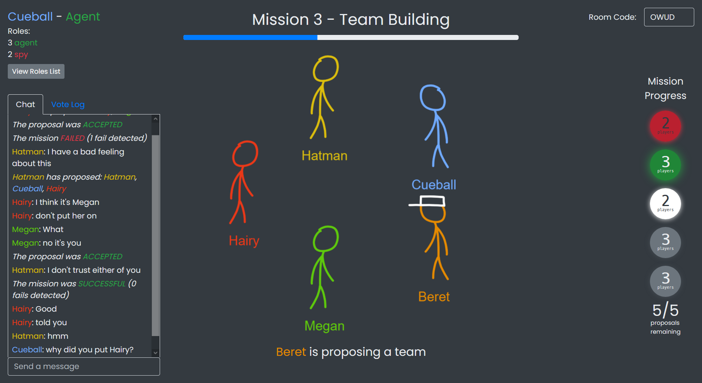

# The Resistance

This is an open source version of the popular party board game [The Resistance][resistance-game]. Based on original game by Don Eskridge.

**Play it now at [https://resistance.thesilican.com][my-website]**



## About

Similar to party games like Mafia and Werewolf, the Resistance challenges players' skills of deception, lying, and social deduction to determine who to trust. **Agents** try to determine who their teammates are and succeed on missions, while **Spys** must work together to decieve everyone, and fail as many missions as possible. Read the full rules [here][rules].

## Features

- Full online multiplayer support
- Games for 5-10 players
- Easy-to-learn user interface
- Many games can run simultaneously

## Installation

### Docker

The Resistance is available on Docker Hub. Make sure you have [docker][get-docker] installed, then run:

```
$ docker run -d -p 8080:8080 --name the-resistance mrsiliconguy/the-resistance
```

Then you can access the game at `http://localhost:8080`

### Manually building container

If you would like to manually build a container from source, first download the repository. Then run docker build and run the container

```
$ git clone https://github.com/MrSiliconGuy/the-resistance.git
$ cd the-resistance
$ docker build . -t <image_name>
$ docker run -d -p 8080:8080 --name <container_name> <image_name>
```

Then you can access the game at `http://localhost:8080`

### Node.js/Javascript

This project has the following directory structure:

```
the-resistance
├─ common
│  └─ src (Common code shared among frontend and backend)
└─ frontend
│  ├─ assets (Images)
│  ├─ public (For index.html)
│  └─ src (Frontend code)
│     ├─ components (React Components)
│     ├─ socket (Socket.IO connector)
│     ├─ store (Flux-like state manager)
└─ src (Backend code)
```

Here are the steps to fully build the project

```
Clone repository from GitHub
$ git clone https://github.com/MrSiliconGuy/the-resistance.git
$ cd the-resistance

Build common code
$ cd ./common
$ npm install
$ npm run build

Build frontend code
$ cd ../frontend
$ npm install
$ npm run build

Build backend server
$ cd ..
$ npm install
$ npm run build
$ npm start
```

Then you can access the game at `http://localhost:8080`

## Technologies

The Resistance was build with the following technologies

- Frontend: [React][react], [React Router][react-router], [Bootstrap][bootstrap], [Bootswatch][bootswatch], [Konva][konva], [SASS][sass], [Typescript][typescript], [Parcel][parcel]
- Backend: [Node.js][nodejs], [Express][express], [Socket.IO][socketio], [Typescript][typescript], [Docker][docker]

## License and Attributions

The original game concept and rules belong to Don Eskridge, the creator of the game.

All code in the repository are available under the MIT License. All image files in this repository were created by me are available under [CC BY 4.0][cc-license].

[my-website]: https://resistance.thesilican.com
[rules]: http://localhost:8080/how-to-play
[resistance-game]: https://en.wikipedia.org/wiki/The_Resistance_(game)
[react]: https://reactjs.org/
[react-router]: https://reactrouter.com/
[bootstrap]: https://getbootstrap.com/
[bootswatch]: https://bootswatch.com
[konva]: https://konvajs.org/
[sass]: https://sass-lang.com/
[typescript]: https://www.typescriptlang.org/
[parcel]: https://parceljs.org/
[nodejs]: https://nodejs.org
[express]: http://expressjs.com/
[socketio]: https://socket.io/
[docker]: https://www.docker.com/
[get-docker]: https://docs.docker.com/get-docker/
[cc-license]: https://creativecommons.org/licenses/by/4.0/
